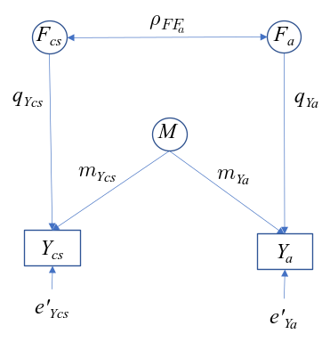
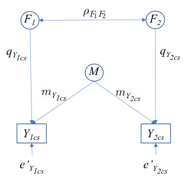

# Introduction

Here we introduce the problem and the package. This should indicate 
* The substantive problem: the literature on measurement error and why this has been a problem (Wiebke)
* The theoretical work by the person who devised what we implement in the package (Wiebke)
* A brief comparison to existing software in the R programming language (Jorge)
* A description of the software we introduce to fix the problem (Jorge)

Packages to check out for Jorge:

https://cran.csiro.au/web/packages/mmc/mmc.pdf
https://cran.r-project.org/web/packages/eivtools/eivtools.pdf
https://rdrr.io/cran/brms/man/me.html
https://cran.r-project.org/web/packages/GLSME/GLSME.pdf

This section should be around a page or so

# Literature on measurement error

This section should describe the three type of corrections that the package implements.
This brief part should introduce the general reader to measurement error literature
and the type of measurement errors techniques which are available and their limitations.

The sections below should contain the images and formulas that describe the 
methods we implement making references to the authors who implemented each one. I've
written down three subsection for each implementation but feel free to change anything you
think should be changed. Since this is a statistical software journal, it's ok to go full in swing with formulas.

Citations can be written like this:
Blah blah [see @alwin2007, pp. 33-35; also @scherpenzeel1997, ch. 1].
Blah blah [@alwin2007, pp. 33-35, 38-39 and *passim*].
Blah blah [@alwin2007; @scherpenzeel1997].

## Correction for simple concepts

Any image can be saved in the folder figs/ and just copy the code below replacing the name of image from below

```{r, out.width = "50%", fig.align = "center", echo = FALSE}

```

## Correction for simple concepts with complex concepts
```{r, out.width = "50%", fig.align = "center", echo = FALSE}

```

## Correct for complex concepts and complex concepts
```{r, out.width = "50%", fig.align = "center", echo = FALSE}

```


# Applications and illustrations

Here we should have 1 example that illustrates the three descriptions from above.
Or, N number of examples showing how to use the methods described above. These
should be fairly simply examples (if more than 1) or one single example which
elaborates in complexity.

From looking at several papers online, I think it might be better to focus on
one example and begin with something simple: only correct for quality, 
then CMV, the simple concepts vs complex concepts and finalize with complex
vs complex concepts. Otherwise it's too difficult (at least for me) to find
several examples that we can use all of the applications.

## Political Trust example

In this case study we will go through an applied example of the capabilities of the `cosme` package.

We'll begin by loading some packages we'll use.


```{r}
library(lavaan)
library(dplyr)
library(ggplot2)
library(essurvey)
library(sqpr)
library(magrittr)

# And cosme
library(cosme)
```

## Read the data

Let's read in the data from the European Social Survey using the `essurvey` package and create a sum score of a number of variables. A sum score is the weighted $(w)$ `sum` of a number of variables $(y_1, y_2, ..., y_k)$ to create a composite score $(CS)$:

<!-- $$ -->
<!-- \begin{align} -->
<!-- 	Y_{cs} = \sum_{i=1}^{k}\frac{w_i}{{\delta_y}_{cs}} Y_i  && \text{where $\frac{w_i}{{\delta_y}_{cs}}$ is the weight of the $i$th observed variable}\\ -->
<!-- \end{align} -->
<!-- $$ -->

Be sure to register at the Europen Social Survey website and run `set_email("your_email@email.com")` replacing the fake email with your registered one.

```{r, results = 'hide'}
# Choose your selected variables
selected_vars <- c("trstprl", "trstplt", "trstprt",
                   "stfedu", "stfhlth", "psppsgv",
                   "psppipl", "ptcpplt", "ppltrst",
                   "polintr", "stflife", "stfeco",
                   "agea", "eisced")

# Download the ESS data and clear missing values
ess7es <- import_country("Spain", 7)[c(selected_vars, "pspwght")]
ess7es <- ess7es[complete.cases(ess7es), ]

# Calculate the standardized but unweighted sums cores

ess7es <-
  within(ess7es, {
    poltrst <- scale(trstprl) + scale(trstplt) + scale(trstprt)
    serv <- scale(stfedu) + scale(stfhlth)
    systmrsp <- scale(psppsgv) + scale(psppipl) + scale(ptcpplt)
  })

# Calculate the standard deviation of each sum score
w_pol <- 1 / sd(ess7es$poltrst)
w_serv <- 1 / sd(ess7es$serv)
w_systmrsp <- 1 / sd(ess7es$systmrsp)

# Create the weighted and standardized composite score
ess7es <-
  within(ess7es, {
    poltrst <- w_pol*scale(trstprl) + w_pol*scale(trstplt) + w_pol*scale(trstprt)
    serv <- w_serv*scale(stfedu) + w_serv*scale(stfhlth)
    systmrsp <- w_systmrsp*scale(psppsgv) + w_systmrsp*scale(psppipl) + w_systmrsp*scale(ptcpplt)
  })

composite_scores <- c("poltrst", "serv", "systmrsp")

all_vars <- c(composite_scores, selected_vars) # for later use
```

So far we have the original `tibble` with a few extra columns containing the composite sum scores:

```{r}
ess7es
```

Let's read in the SQP data. The Survey Quality Predictor (SQP) database contains the quality information of thousands of questions. We can access this database with the `sqpr` package. To do that, you'll need to register with the SQP ([sqp.upf.edu](www.sqp.upf.edu)) and then we can login with `sqp_login()` using your valid SQP credentials:

```{r, eval = FALSE}
sqp_login("your user name", "your password")
```

```{r, echo = FALSE}
sqp_login()
```

Once that's done, we can continue accessing the data.

```{r}

me_data <-
  get_sqp(
    study = "ESS Round 7",
    question_name = selected_vars[1:12],
    country = "ES",
    lang = "spa"
  )

```

Let's confirm all of our questions were extracted.

```{r}
me_data
```

Why are we only selecting 12 of our 14 variables? You'll see later on. We will add the measurement quality of the last two manually because they're not in the SQP database.

## Analysis

With the function `me_sscore` we can calculate the quality of a sum score. Remember those sum scores we calculated at the beginning? We can calculate the quality of the sum score by specifying the data from the SQP API, the data from the European Social Survey and provide `me_sscore` with the variables that contribute to the sum score.

For example, this code..

```{r}

me_sscore(me_data = me_data,
          .data = ess7es,
          new_name = poltrst,
          trstprl, trstplt, trstprt)

```

creates a new variable called `poltrst` which will have the quality of the sum score of `trstprl`, `trstplt`, `trstprt`. Note that these three variables are **not** present anymore, but only `poltrst`, the summary of the three. For our analysis we want to repeat that for the three sum scores from the beginning. Let's extend it:

```{r}

quality <-
  me_data %>%
  me_sscore(ess7es, new_name = poltrst, trstprl, trstplt, trstprt) %>%
  me_sscore(ess7es, new_name = serv, stfedu, stfhlth) %>%
  me_sscore(ess7es, new_name = systmrsp, psppsgv, psppipl, ptcpplt)

```

Let's see how it looks like.

```{r}
quality
```

Great! We have our summarized `tibble`. Sometimes you'll want to manually append predictions such as quality estimates not available in the SQP API. For our case, we want to add the `quality` estimates of the variables `agea` and `eised` (remember those two we were excluding from before? we were excluding them because they're not available in the SQP data base). For that we can use `me_bind_metrics`.

```{r}
quality <-
  quality %>%
  me_bind_metrics(agea, list(quality = 1)) %>%
  me_bind_metrics(eisced, list(quality = 0.93))

quality
```

Note that `me_bind_metrics` is very strict, it accepts an `me` data frame (given by `sqpr::get_sqp`) and it will match that the names of your estimates (`quality` here) matches exactly the same names in the SQP API. You can read more about it in `?me_bind_metrics`. Finally, let's order our results.

```{r}

variables_order <- c("poltrst",
                     "serv",
                     "systmrsp",
                     "ppltrst",
                     "polintr",
                     "stflife",
                     "stfeco",
                     "agea",
                     "eisced")

quality <- quality[match(variables_order, quality$question), ]

```

Briefly, let's also select these variables for ESS data.

```{r}
ess7escorr <- ess7es[c(variables_order, "pspwght")]
```

## Correlations and correcting for measurement error

Let's get the correlation of all the variables in the ESS data.

```{r}
# Exploratory correlation matrix (in order of the columns in data frame):
original_corr_2 <- cor(ess7escorr, use = "complete.obs", method = "pearson")
original_corr_2
```

`cosme` has a very similar function to `cor` but allows to replace the diagonal and weight the correlation. In our analysis we can use it to multiply the diagonal with the quality estimates of all the variables and use the `pspwght` from the European Social Survey.

```{r}

me_design <- medesign("~ stfeco + stflife",
                      ess7es[variables_order],
                      quality)

```

It's the same correlation coefficients but with the diagonal set to the quality of the estimates. But **note** that both the order of the variables `Quality` and the order of the variables in `ess7corr` should be the same! Otherwise we might confuse quality estimates between variables.

For variables which are measured with the same method, we want to account for their Common Method Variance (CMV). The `cosme` package makes this very easy using the `me_cmv_cor` function. Supply the correlation data frame, the `Quality` dataset with quality estimates and `me_cmv_cor` estimates the CMV between the variables specified (here only two) and subtracts it from the correlation.

```{r}

corrected_corr <- me_cmv_cor(me_design)

```

Here we have a corrected matrix for both measurement error and for the common method variance of some variables. We can dump this into our `sem` models and get estimates corrected for measurement error.

## Regression model

```{r}

model <- "poltrst ~ ppltrst + stflife + polintr + stfeco + serv + systmrsp + agea + eisced"

# Model based on original correlation matrix
fit <-
  sem(model,
      sample.cov=original_corr_2,
      sample.nobs= 1624)

# Model based on corrected correlation matrix
corrected_corr <- as.data.frame(corrected_corr)
rownames(corrected_corr) <- corrected_corr$rowname
corrected_corr$rowname <- NULL

fit.corrected <-
  sem(model,
      sample.cov=as.matrix(corrected_corr),
      sample.nobs= 1624)

```

Let's look at how much the coefficients differ

```{r, fig.width = 7, fig.with = 9}

coef_table <-
  list(fit, fit.corrected) %>%
  lapply(parameterestimates) %>%
  lapply(function(.x) .x[.x$lhs == "poltrst", ]) %>%
  lapply(function(.x) .x[c("rhs", "est", "ci.lower", "ci.upper")]) %>%
  do.call(rbind, .)

coef_table$model <- rep(c("original", "corrected"), each = 9)

coef_table %>%
  ggplot(aes(rhs, est, colour = model)) +
  geom_linerange(aes(ymin = ci.lower, ymax = ci.upper), position = position_dodge(width = 0.5)) +
  geom_point(position = position_dodge(width = 0.5)) +
  labs(x = "Predictors", y = "Estimated coefficients") +
  theme_bw()

```

It differs slightly between models (although strongly for the dependent variable). Another approach is getting the ratio between the corrected over the original model.

```{r}
# Relative increase (they don't only go up!):
coef(fit.corrected) / coef(fit)
```

It looks like the results do differ substantially! Otherwise everything would be at `1`.

Moreover, the R-squares of the models differ quite substantially.

```{r}
R2_uncorr <- inspect(fit, 'r2')
R2 <- inspect(fit.corrected, 'r2')

# Change of R2:
R2 - R2_uncorr
```

# Summary

# Acknowledgments

Everyone we acknowledge and funding

# Computational details

Version for packages we used, R version, operating system

# References

